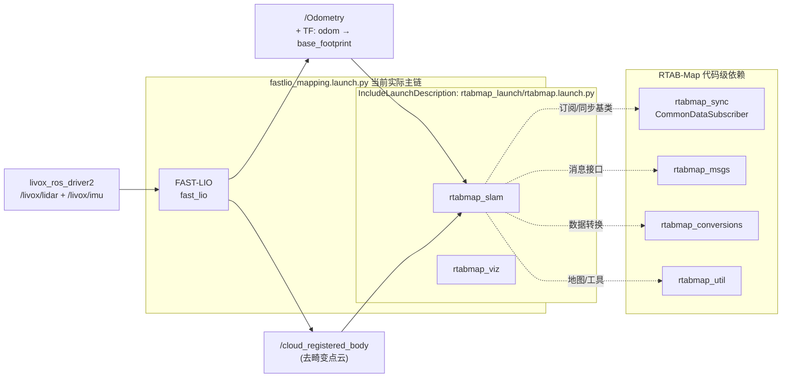
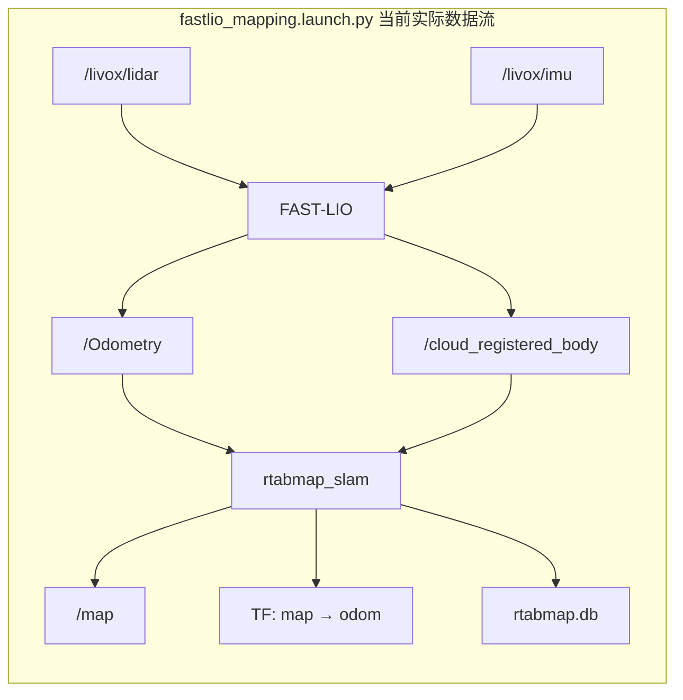

# RTAB-Map 导航项目（从零到一）
官方链接：https://github.com/introlab/rtabmap_ros

本仓库用于落地一套分层清晰的 ROS2 导航方案：

- `FAST-LIO` 负责雷达惯性里程计（发布 `odom -> base_footprint`）
- `RTAB-Map` 负责全局建图/回环/重定位（发布 `map -> odom`）
- `Nav2` 负责规划、控制与避障执行
## 0.编译
```bash
do_build_all.sh  #直接编译就行
```

## 0.1 最小启动命令

先加载环境：

```bash
cd ~/rtabmap_nav2_stack
source /opt/ros/humble/setup.bash
source install/setup.bash
```

建图：

```bash
ros2 launch robot_bringup fastlio_mapping.launch.py
```

定位：

```bash
ros2 launch robot_bringup bringup.launch.py mode:=localization
```

定位（指定数据库）：

```bash
ros2 launch robot_bringup bringup.launch.py mode:=localization database_path:=/data/maps/site_a/rtabmap.db
```

导航：

```bash
ros2 launch robot_bringup bringup.launch.py mode:=navigation
```

导航（指定数据库）：

```bash
ros2 launch robot_bringup bringup.launch.py mode:=navigation database_path:=/data/maps/site_a/rtabmap.db
```

说明：

- `fastlio_mapping.launch.py` 是当前建图主入口
- `bringup.launch.py` 是总入口，`mode:=localization` 用已有数据库做重定位，`mode:=navigation` 继续拉起 Nav2
- `mode:=navigation` 已经内含定位，不需要先单独启动一次 `mode:=localization`
- RTAB-Map 的 2D 地图统一发布到全局 `/map`
- `rtabmap.db` 默认路径是 `/data/maps/site_a/rtabmap.db`
- 可以通过 `database_path:=/你的路径/rtabmap.db` 显式传入数据库路径
- 定位和导航前，需要已有可用的 `rtabmap.db`

## 0.2 导出 PCD

默认建图数据库位于：

```bash
~/.ros/rtabmap.db
```

导出 PCD：

```bash
cd ~/rtabmap_nav2_stack
python3 scripts/extract_pcd_from_db.py ~/.ros/rtabmap.db
```

指定数据库路径导出：

```bash
python3 scripts/extract_pcd_from_db.py /data/maps/site_a/rtabmap.db
```

指定数据库和输出目录：

```bash
python3 scripts/extract_pcd_from_db.py /data/maps/site_a/rtabmap.db /data/maps/site_a/export
```

说明：

- 脚本会同时导出 `PCD` 和 `PLY`
- 默认输出目录为仓库下的 `cloud_map/`
- 建议在建图结束、`rtabmap.db` 写完后再执行导出

## 0.3 导出导航用 2D 栅格图

导出当前 `/map` 为 `pgm + yaml`：

```bash
cd ~/rtabmap_nav2_stack
source /opt/ros/humble/setup.bash
source install/setup.bash
ros2 run nav2_map_server map_saver_cli -t /map -f /data/maps/site_a/nav2_map
```

说明：

- 输出文件为 `/data/maps/site_a/nav2_map.pgm` 和 `/data/maps/site_a/nav2_map.yaml`
- 该命令保存的是当前正在发布的 `/map` 话题，所以需要 RTAB-Map 已经在运行并发布地图
- 建议在定位或导航链路稳定后执行，得到给 Nav2 使用的 2D 占据栅格图

## 1. 仓库结构

```text
rtabmap_nav2_stack/                 # 工作空间
├── src/                            # ROS 2 工作空间源码目录
│   ├── robot_bringup/              # 高级导航启动包组，包含 Nav2 的精细配置
│   │   ├── launch/                 # 启动脚本存放目录
│   │   │   ├── fastlio_mapping.launch.py # 当前建图主入口（FAST-LIO + RTAB-Map）
│   │   │   ├── bringup.launch.py   # 总启动入口，控制全自动导航的各个模块
│   │   │   └── rtabmap_bridge.launch.py # 负责将 RTAB-Map 的输出桥接到 Nav2 栈
│   │   └── config/                 # 核心参数配置目录
│   │       └── nav2_common.yaml    # Navigation 2 配置
│   ├── FAST_LIO_ROS2/              # FAST-LIO 激光惯性紧耦合里程计（提供 odom 和去畸变点云）
│   ├── livox_ros_driver2/          # Livox MID360 雷达驱动
│   ├── navigation2/                # Nav2 导航栈源码，提供路径规划、轨迹控制与恢复行为
│   └── rtabmap_ros/                # 官方 RTAB-Map ROS 2 包装层
│       ├── rtabmap_launch/         # （done）通用 Launch 入口，  目前的脚本走的就是这个
│       ├── rtabmap_slam/           # （done）SLAM 核心节点，负责建图、回环检测、图优化与重定位
│       ├── rtabmap_odom/           # （done）视觉/深度/激光前端里程计节点，提供局部连续位姿估计
│       ├── rtabmap_sync/           # （done）多传感器时间同步节点，将 RGB、Depth、Scan、IMU 整理成统一输入
│       ├── rtabmap_util/           # （done）点云、栅格、图像和 TF 处理工具节点集合
│       ├── rtabmap_msgs/           # （done）RTAB-Map  ROS 2 消息与服务类型定义
│       ├── rtabmap_conversions/    # （done）RTAB-Map C++ 核心数据结构与 ROS 消息/TF/OpenCV 之间的转换库
│       ├── rtabmap_rviz_plugins/   # （done）RViz 中显示地图图结构、点云、回环和调试信息的插件
│       ├── rtabmap_viz/            # （done）RTAB-Map 自带可视化界面节点，便于查看节点图、回环和局部地图
│       ├── rtabmap_costmap_plugins/# （done）给 Nav2提供3D体素地图能力，
│       ├── rtabmap_python/         # （done）Python 绑定与脚本接口，便于离线分析和轻量二次开发
│       ├── rtabmap_ros/            # （done）元包/聚合包，用于统一依赖导出和整体发布
│       ├── rtsp_camera_bridge/     # （不用理，不是原生包）RTSP 相机桥接节点，把网络视频流接入 ROS 图像话题
│       ├── rtabmap_examples/       # （done）单体传感器或典型设备（如 Realsense）的使用示例
│       └── rtabmap_demos/          # （done）完整机器人的离线建图仿真与演示程序
├── third_party/                    #
│   └── rtabmap-0.23.4/             # RTAB-Map C++ 核心算法源码，保证版本一致性
├── scripts/                        # 编译和配置脚本
│   ├── build_rtabmap_0234.sh       # （done）隔离编译 RTAB-Map 核心层脚本
│   └── use_rtabmap_0234_env.sh     # （done）供 colcon 编译时挂载核心库路径的环境脚本
```

## 2.建图过程  

当前建图主入口为 `fastlio_mapping.launch.py`，使用 FAST-LIO 取代了之前的 icp_odometry + EKF 方案。

### 2.1  包协作过程



- FAST-LIO 直接消费 `/livox/lidar` 和 `/livox/imu`，输出激光惯性紧耦合里程计 `/Odometry`，同时发布 `odom -> base_footprint` TF
- FAST-LIO 还输出去运动畸变后的点云 `/cloud_registered_body`，供 RTAB-Map 做回环检测和建图
- `rtabmap_slam` 消费 `/Odometry` 和 `/cloud_registered_body`，执行图优化并发布 `map -> odom` TF
- 不再使用 `icp_odometry`、`robot_localization (EKF)` 等中间环节，链路更短更简洁

### 2.2  关键数据流向



最终 TF 主链：

```text
map → odom → base_footprint → base_link → livox_frame
 ↑      ↑        (static)       (static)
rtabmap FAST-LIO
```
